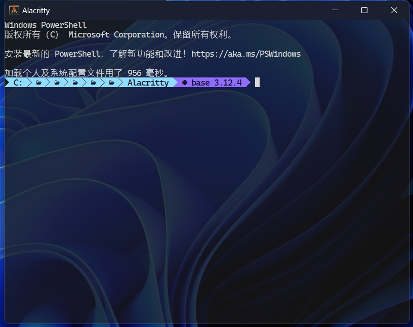

# Orz's Alacritty Config

## Install
### Post INSTALL
- git
- [Alacritty](https://alacritty.org/index.html)
### MacOS/Linux
```bash
git clone https://github.com/kanrin/my-alacritty-config.git $HOME/.config/alacritty
```
### Windows
```cmd
git clone https://github.com/kanrin/my-alacritty-config.git %APPDATA%\alacritty
```

## Config Docs
[Alacritty](https://alacritty.org/config-alacritty.html)

## Enjoy!
- default theme is onedark
- Thanks [alacritty-theme](https://github.com/eendroroy/alacritty-theme)
- works like pytty
    - select copy to clipboard
    - right click to prase
